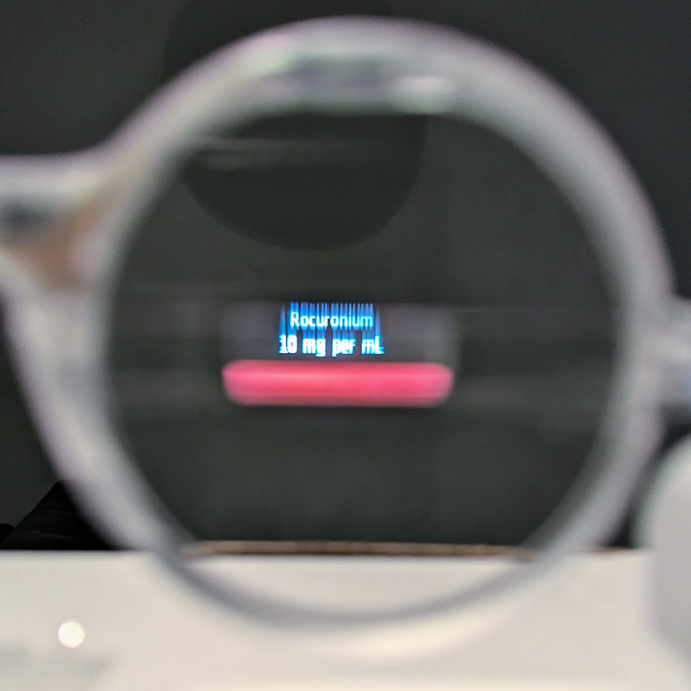
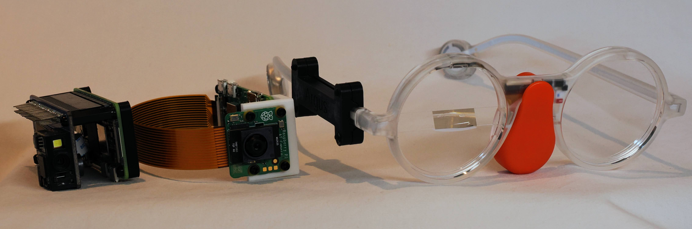
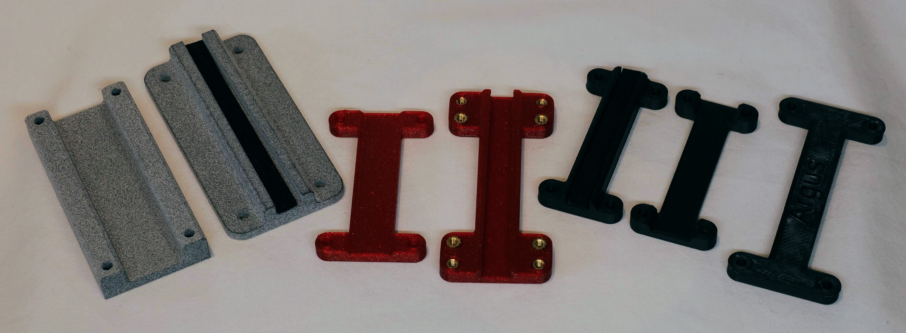
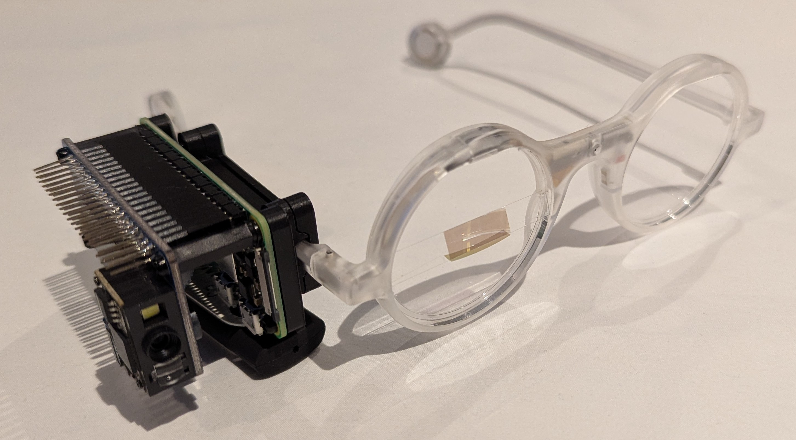

# Argus

Argus is a proof-of-concept wearable medication safety system designed to reduce drug administration errors in clinical settings. Instead of requiring staff to use handheld scanners, it surfaces verification information directly in the user's field of view.

Medication errors occur in approximately 10% of ICU patient days, with around half happening at the point of administration — not in prescribing or dispensing, but in the final step when the drug reaches the patient. Traditional barcode medication administration (BCMA) systems suffer from poor compliance in high-pressure environments due to ergonomic friction. Argus attempts to address this by making verification hands-free and in-situ.

The system scans drug packaging barcodes (GTIN) and DataMatrix codes (batch and expiry data), validates them against a drug database, and displays the result on a monocular heads-up display worn by the clinician. A double-tap gesture on the glasses confirms administration and logs the dose.

This was presented at the ICS State of the Art Conference in December 2025. Full write-up at [glfharris.com](https://www.glfharris.com/posts/2025/argus/).

## Hardware

- **Brilliant Labs Frame** — monocular head-mounted display
- **Raspberry Pi Zero 2W** — edge compute
- **Camera module** — barcode scanning
- **3D-printed mounting brackets** — designed in FreeCAD

- **USB power bank** — portable power

## Software & Technologies

- **Python** with `asyncio` for concurrent image capture, processing, and display
- **OpenCV** (`opencv-python`) — image capture and processing
- **pyzbar** — barcode and QR code decoding
- **Brilliant Labs Frame SDK** — Bluetooth communication with the Frame glasses, display rendering, and tap gesture detection via the Frame's IMU
- **Rich** — terminal UI for monitoring administrations and logs
- **Pillow** — image handling
- **bleak** — Bluetooth Low Energy communication
